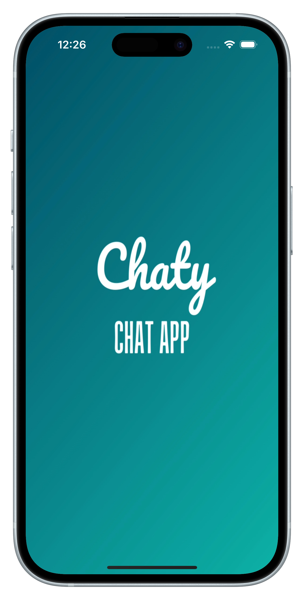
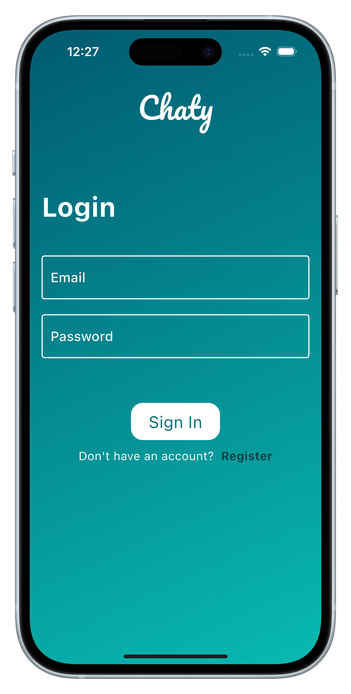
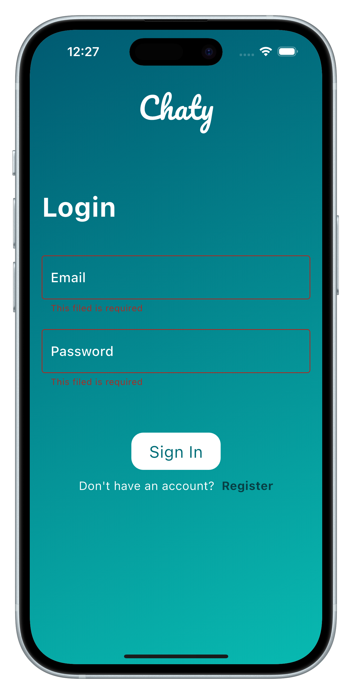
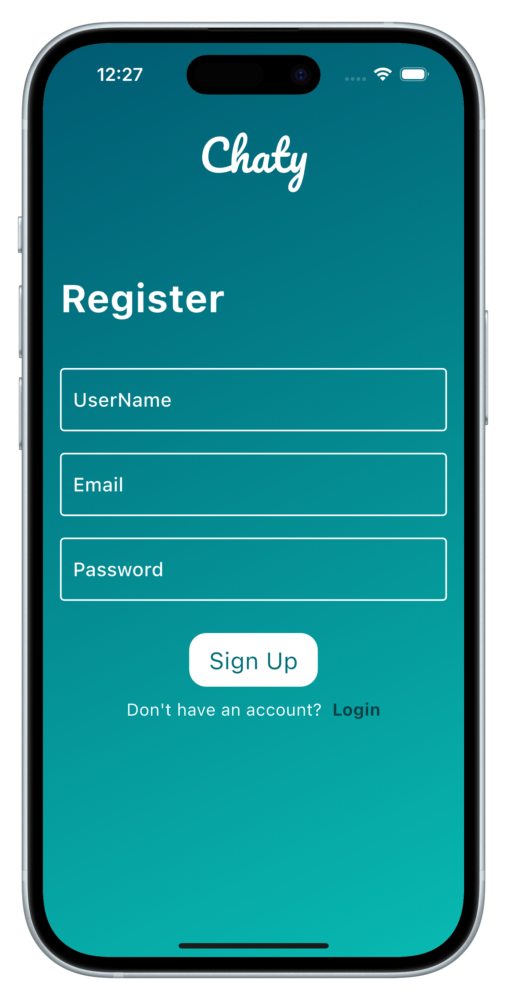
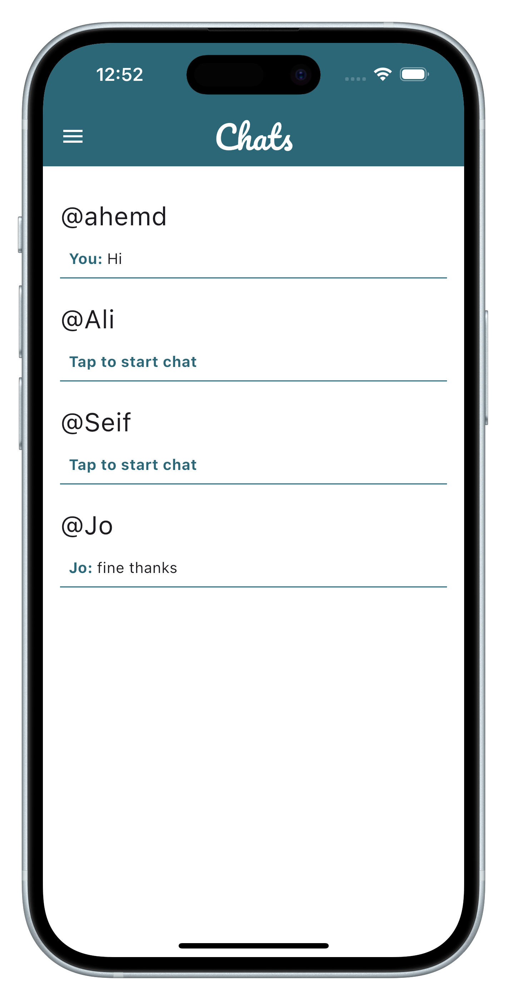
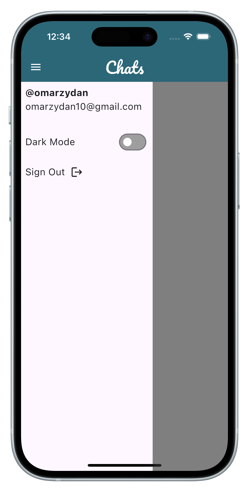
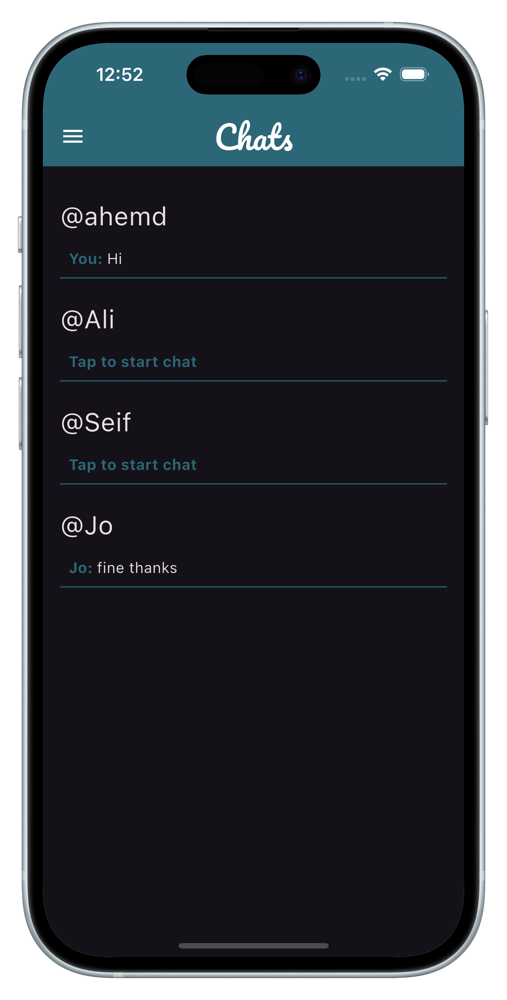
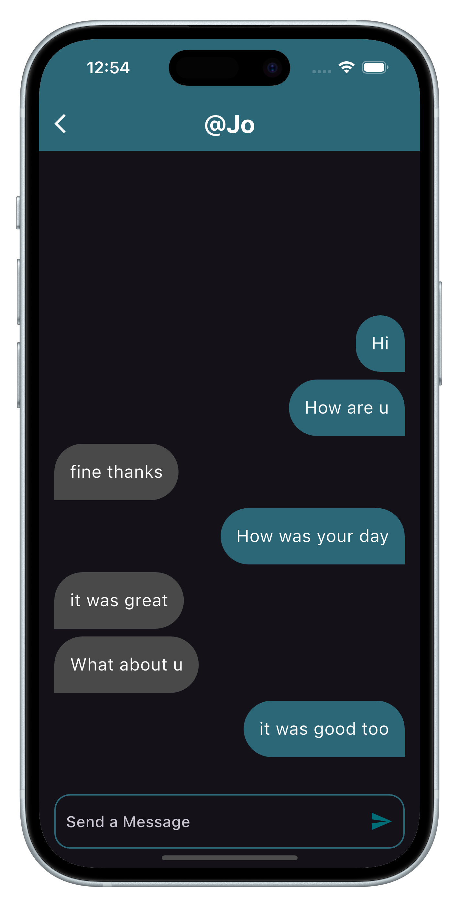

# Chaty

Chaty is a modern chat application built with Flutter, offering a rich set of features for seamless communication. It provides functionalities for user authentication, dark mode support, and real-time message storage using Firebase.

## Features

- **Sign In and Sign Up:** Secure user authentication with Firebase.
- **Dark Mode:** Toggle between light and dark themes for a better user experience.
- **Real-Time Messaging:** Store and order messages in real-time using Firestore.
- **User Profiles:** Manage user profiles and personal information.

## Screenshots

### Splash Screen

 

### Login Page



##### Login Page With Errors



### Registeration Page



### Chats Page (Light Mode)



### Menu (Light Mode)


### Conversation Page (light Mode)


### Chats Page (Dark Mode)


### Menu (Dark Mode)


### Conversation Page (Dark Mode)


## Installation

Follow these steps to set up and run the Chaty application on your local machine:

1. **Clone the Repository:**
   ```bash
   git clone https://github.com/USERNAME/Chaty.git
   ```

```

```
